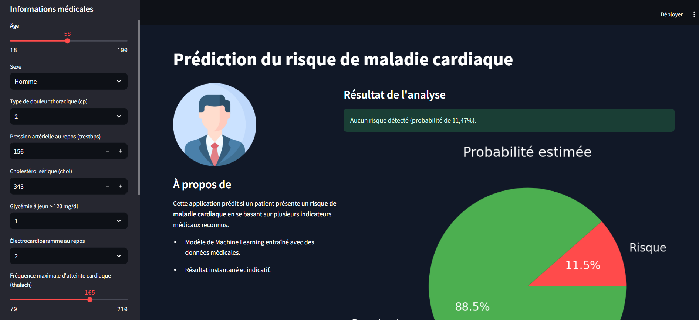

# Prédiction de Maladie Cardiaque

Ce projet utilise un modèle de Machine Learning pour prédire si un patient présente un **risque de maladie cardiaque**, à partir de caractéristiques cliniques simples. L'application est déployée via **Streamlit**.

---

## Structure du projet

```
│
├── app.py                          # Application Streamlit (interface utilisateur)
│
├── models/                       # Modèle entraîné sauvegardé
│   └── best_model.pkl
│
├── data/                         # Données brutes et nettoyées
│   ├── HeartDiseaseUCI.csv              # Données originales
│   └── heart_disease_clean.csv          # Données nettoyées prêtes à l'entraînement
│
├── notebooks/                    # Analyse exploratoire et modélisation
│   ├── data_exploration.ipynb           # EDA, visualisations, preprocessing
│   └── model_training.ipynb             # Entraînement et évaluation des modèles
│
├── .gitignore                    # Fichiers/dossiers à ignorer par Git
├── requirements.txt              # Dépendances du projet
└── README.md                     # Documentation du projet

```

---

##  Lancer l'application

### 1. Cloner le projet et installer les dépendances

```bash
pip install -r requirements.txt
```

### 2. Lancer l'application Streamlit

```bash
streamlit run app/streamlit_app.py
```

L'interface s'ouvre automatiquement dans le navigateur 

---
## Aperçu de l'application



##  Fonctionnalités

- Formulaire intuitif dans la barre latérale
- Image et design personnalisés pour le thème médical
- Prédiction de la probabilité de risque
- Affichage dynamique du résultat sous forme de graphique circulaire
- Aucune base de données nécessaire : prédiction en local

---

##  Variables utilisées

- `age`, `sex`, `cp`, `trestbps`, `chol`, `fbs`, `restecg`
- `thalach`, `exang`, `oldpeak`, `slope`, `ca`, `thal`

Ces variables sont normalisées dans le modèle entraîné.

---

##  Modèle

Le modèle utilisé est un classificateur de Machine Learning entraîné à partir de données publiques sur les maladies cardiaques. Il a été sauvegardé via `joblib`.

---

##  Auteur

- **Nom** : Owen Mouketou  
- **Email** : [mouketoudielowen@gmail.com](mailto:mouketoudielowen@gmail.com)  
- **LinkedIn** : [linkedin.com/in/owen-mouketou](https://linkedin.com/in/owen-mouketou)

## Disclaimer

> Ce projet a été conçu dans un but **démonstratif et d'apprentissage**.  
> Il ne constitue en aucun cas un dispositif médical certifié ni un outil de diagnostic fiable pour un usage clinique.  
> Les résultats produits par l’application sont basés sur des modèles statistiques entraînés sur un jeu de données public, et **ne doivent jamais se substituer à l’avis d’un professionnel de santé qualifié**.